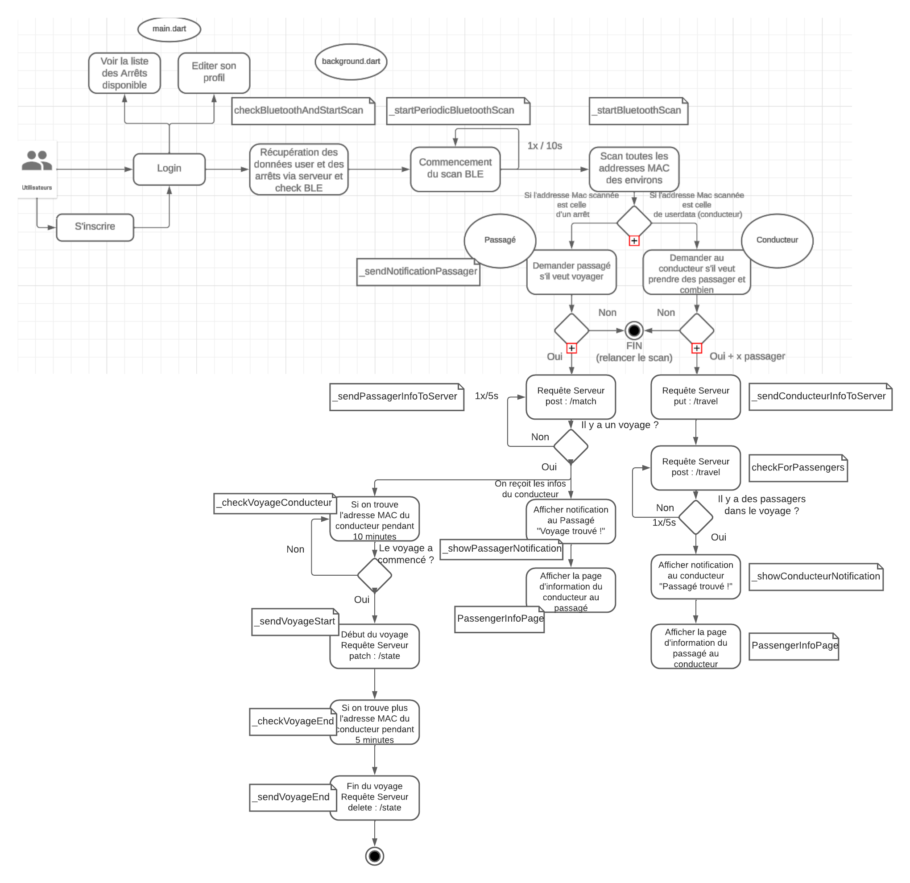

# Navette - Application de Covoiturage

Navette est une application de covoiturage innovante utilisant des balises Bluetooth pour connecter conducteurs et passagers. Cette application est conçue pour faciliter les trajets quotidiens en offrant une solution de covoiturage pratique et efficace.

Notre objectif ici est de proposer une application fonctionnelle en l'état, le design arrive ensuite

## Prérequis

Avant de commencer, assurez-vous d'avoir les éléments suivants installés sur votre système :
- Flutter SDK
- Dart
- Android Studio

## Installation

### Flutter et Dart

1. **Téléchargez le Flutter SDK** :
   Visitez [Flutter](https://flutter.dev/docs/get-started/install) et suivez les instructions spécifiques à votre système d'exploitation.

2. **Ajoutez Flutter à votre PATH** :
   Assurez-vous que le chemin `flutter/bin` est ajouté à votre variable d'environnement PATH.

3. **Vérifiez l'installation** :
   Ouvrez un terminal et exécutez `flutter doctor`. Suivez les instructions pour résoudre d'éventuelles dépendances manquantes.

### Android Studio

1. **Téléchargez et installez Android Studio** :
   Rendez-vous sur [Android Studio](https://developer.android.com/studio) et téléchargez l'installateur pour votre système d'exploitation.

2. **Configurez l'émulateur Android** :
   Lancez Android Studio, ouvrez les `AVD Manager`, et configurez un émulateur Android pour tester l'application.

## Lancement de l'Application sur un Téléphone

1. **Activez le mode développeur sur votre téléphone Android** :
   Allez dans les paramètres, puis à propos du téléphone, et appuyez 7 fois sur le numéro de build pour activer le mode développeur.

2. **Connectez votre téléphone à votre ordinateur via USB**.

3. **Activez le débogage USB** :
   Dans les options pour développeurs, activez le débogage USB.

4. **Lancez l'application depuis Android Studio** :
   Ouvrez le projet dans Android Studio, sélectionnez votre appareil dans la liste des dispositifs disponibles, et cliquez sur `Run`.

## Création d'un Fichier APK

Pour distribuer l'application, vous pouvez créer un fichier APK :

1. **Ouvrez votre projet Flutter dans Android Studio**.

2. **Allez dans le menu `Build`** :
   Choisissez `Build Bundle(s) / APK(s)` puis `Build APK(s)`.

3. **Trouvez l'APK généré** :
   Une fois la construction terminée, vous trouverez le fichier APK dans le dossier `build/app/outputs/flutter-apk/` de votre projet.

4. **Testez l'APK** :
   Installez l'APK sur votre appareil pour tester si tout fonctionne correctement.

## Contribution

Pour contribuer à ce projet, veuillez suivre les instructions suivantes :
- Fork ce repository.
- Créez une nouvelle branche pour vos modifications.
- Soumettez une pull request pour révision.

Nous apprécions vos contributions pour améliorer Navette et aider la communauté du covoiturage.

## Diagramme de fonctionnaité

