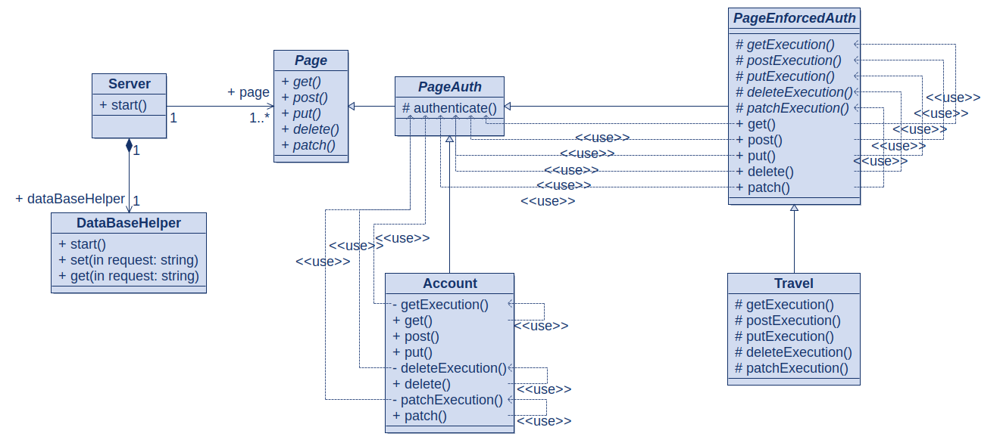

# Covoiturage périurbain côté serveur
## Développé avec NodeJS LTS v18.17.1 et MariaDB v11.1.2 :
```bash
sudo systemctl start mariadb; mariadb --verbose -u user -p < "init.sql"; npm ci --only=production; npm start
```
## La configuration du serveur et de la connexion à la BDD se fait dans ./config.json
### J'utilise les credentials user:user sur la databse cvp [(documentation)](https://wiki.archlinux.org/title/MariaDB#Add_user)
## Le serveur supporte les requêtes :
- /debug (ouvert)
    - GET: page d'interraction
- /account (GET est authentifié, le reste est ouvert)
    - PUT: créer compte -> mail:email, name:text, password:password, role:driver||passenger
    - PATCH: initialiser le compte -> numberplate:text, mac:text / void
    - POST: obtenir un token de connexion à mettre dans le header Authorization tel quel -> mail:text, password:password
    - GET: obtenir les infos du compte
- /travel (authentifié)
    - PUT: créer un voyage -> departure:text, arrival:text, seats:number
    - GET: voyage courant
    - PATCH: s'inscrire à un voyage -> travel_id:number
    - POST: rechercher un voyage -> departure:text, arrival:text
- /match (authentifié)
    - POST: s'inscrire à un voyage automatique -> departure:text, arrival:text

